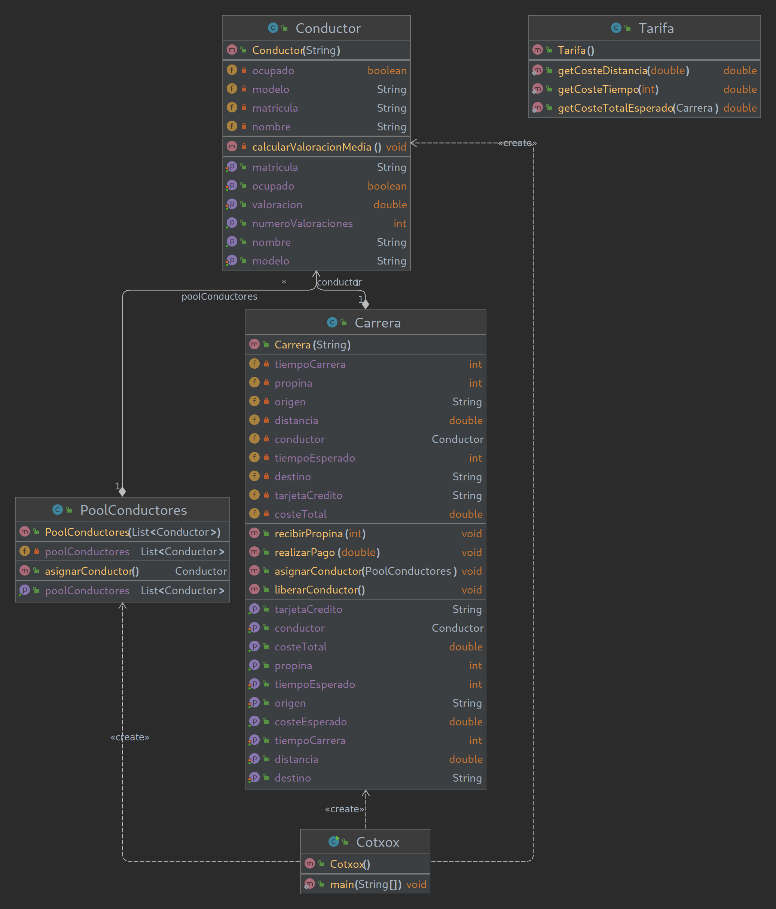

# Cotxox

## III Examen Programación DAW Dual
Para las famosísimas carreras de karts del CIFP Francesc de Borja Moll, es requerido un programa para asignar los alumnos conductores a las diferentes carreras y calcular el coste total de estas.  
Crea el programa con la ayuda del diagrama UML.  

For the world-wide famous CIFP Francesc de Borja Moll's karts races, is required a program to assign the different student pilots to the different races and calculate the total price for each one.   
Create the program with the help of the UML diagram.  

## Key-Concepts :dart: 
- ArrayLists
- Random
- Static Methods
- Streams filter

## UML
